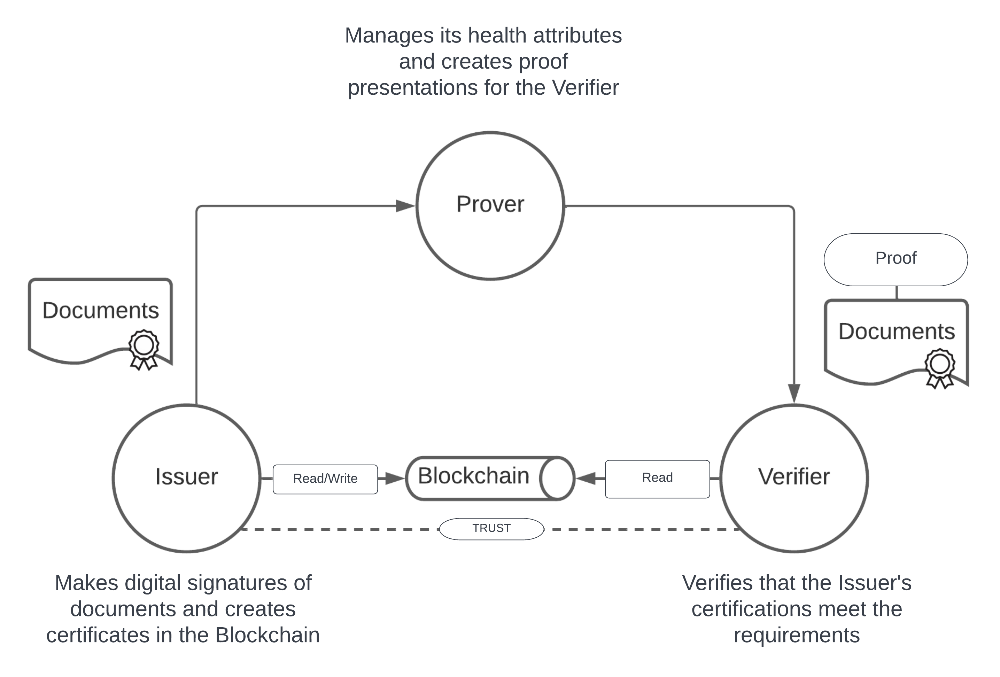
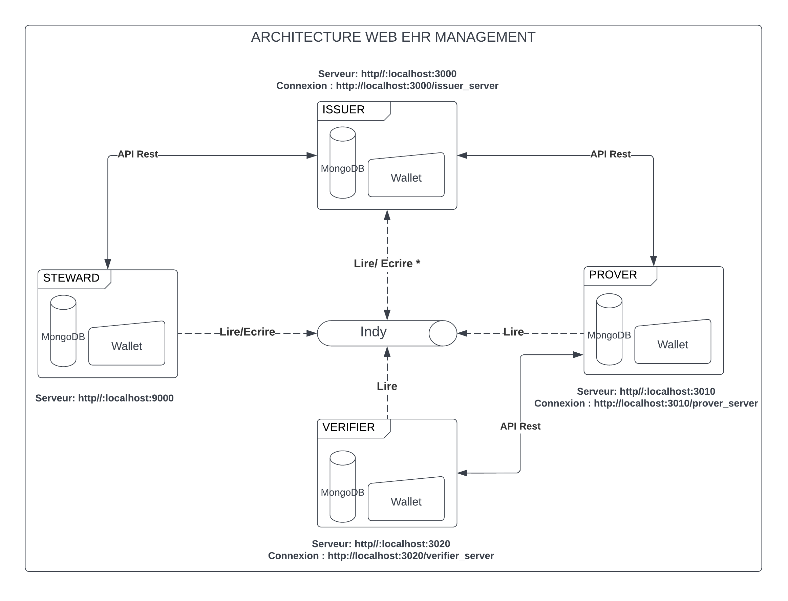

# ELECTRONIC HEALTH RECORDS MANAGEMENT SYSTEM
### Version :
* Branche releases 1.0.X [(Première version du projet)](https://github.com/mohamedberte/EHR_MANAGEMENT/tree/release/1.0.x)
## Objectif
Le système de gestion des dossiers médicaux implémenté est une solution qui permet aux patients d'avoir le contrôle total sur leur identié ainsi que leurs attributs de santé tout en facilitant l'accès aux informations en cas de besoin.

## Acteurs
Le système de gestion des dossiers médicaux fait appel à 3 acteurs qui ont tous un rôle spécifique au niveau de des échanges. Nous avons le fournisseur de données appelé Issuer, le donneur de preuve appelé Prover et le vérificateur de 
preuve appelé Verifie.




## Architecture web
L'architecture web mise en place utilise plusieurs technologies qui doivent impérativement être installé au préalable avant de pouvoir faire des manipulations. Elle est constituée de 4 services :
- Issuer avec l'adresse http//:localhost:3000
- Prover avec l'adresse http//:localhost:3010
- Verifier avec l'adresse http//:localhost:3020
- Steward avec l'adresse http//:localhost:9000




### Prérequis
* Python 
* Wsl avec la version Ubuntu ou directement sous linux
* Indy network lancé au préalable avec le docker [(Instructions)](https://github.com/TrustNetPK/indy-env-setup) 
* Node 8.x

### Première étapes
La première étape est la phase d'initialisation du réseau Indy. Si cela n'est pas encore fait sur votre machine, alors vous devez suivre ces instructions ci-dessous :
* D'abord vous  devez télécharger et installer le docker [(lien de téléchargement)](https://www.docker.com/)

* Cloner le projet git sur votre  machine : https://github.com/mohamedberte/EHR_MANAGEMENT/edit/main/README.md

* Ouvrir le terminal à partir de votre dossier puis lancer la commande suivante pour être sur terminal linux :
```console
wsl
```

* Puis lancer cette commande pour build le réseau indy sur le docker

```console
npm run ledger:build
npm run ledger:start
```
Pour l'arrêter, il suffit de taper :

```console
npm run ledger:stop
```


### Deuxième étapes
Une fois que le réseau indy est lancé, nous pouvons maintenant lancer nos serveurs mais bien avant, nous allons installer les packages nécessaire pour le lancement de notre projet avec la commande suivante :

```console
npm install
```
Puis lancer les services MongoDB avec :
```console
sudo service mongodb start
```
Et sur chaque terminal, nous allons lancer :
* Pour le Steward :
```console
node nodes/app.js
```
* Pour le Issuer :
```console
node issuer/app.js
```
* Pour le Prover :
```console
node prover/app.js
```
* Pour le Verifier :
```console
node verifier/app.js
```

## Vidéo de démonstration
La vidéo de démonstration se trouce ci-dessous :
<object width="425" height="350">
  <param name="movie" value="#" />
  <param name="wmode" value="transparent" />
  <embed src="#"
         type="application/x-shockwave-flash"
         wmode="transparent" width="425" height="350" />
</object>
</hr>
