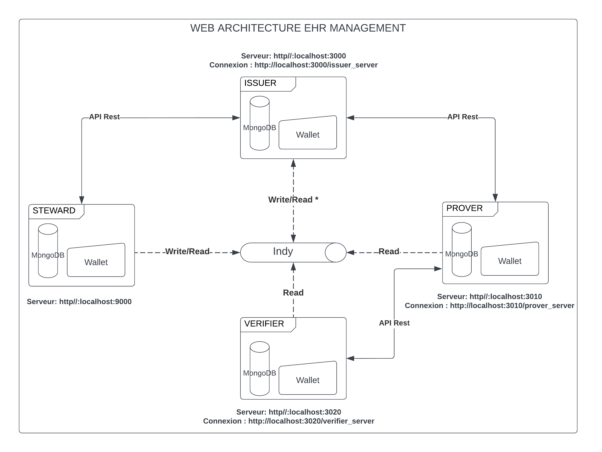

# ELECTRONIC HEALTH RECORDS MANAGEMENT SYSTEM
### Version
* Branche releases 1.0.X [(first version release)](https://github.com/mohamedberte/EHR_MANAGEMENT/tree/release/1.0.x)
## Objective
The health record management system implemented is a solution that allows patients to have full control over their identity and health attributes while facilitating access to information when needed.

## Actor
The health record management system involves 3 actors who all have a specific role in the exchange. We have the data provider called Issuer, the evidence giver called Prover and the evidence verifier called 
called Verifier.


## Web architecture
The web architecture uses several technologies that must be installed before being able to make manipulations. It consists of 4 services:
- Issuer with http//:localhost:3000
- Prover with http//:localhost:3010
- Verifier with http//:localhost:3020
- Steward with http//:localhost:9000




### Requirements
* Python 
* Wsl with the Ubuntu version or directly under linux
* Indy network lancé au préalable avec le docker [(Instructions)](https://github.com/TrustNetPK/indy-env-setup) 
* Node 8.x

### Step 1
The first step is the initialization phase of the Indy network. If this has not yet been done on your machine, you should follow these instructions below:
* First you need to download and install the docker [(Download)](https://www.docker.com/)

* Clone the git project on your machine: https://github.com/mohamedberte/EHR_MANAGEMENT/edit/main/README.md

* Open the terminal from your folder then run the following command to be on linux terminal :
```console
wsl
```

* Then run this command to build the indy network on the docker

```console
npm run ledger:build
npm run ledger:start
```
To stop it, just use this command :
```console
npm run ledger:stop
```


### Step 2
Once the indy network is launched, we can now launch our servers but before that, we will install the packages necessary to launch our project with the following command:

```console
npm install
```
Then start the MongoDB services with :
```console
sudo service mongodb start
```
And on each terminal, we will run :
* For Steward :
```console
node nodes/app.js
```
* For Issuer :
```console
node issuer/app.js
```
* For Prover :
```console
node prover/app.js
```
* For Verifier :
```console
node verifier/app.js
```

## Demo video
The demonstration video is below
<object width="425" height="350">
  <param name="movie" value="#" />
  <param name="wmode" value="transparent" />
  <embed src="#"
         type="application/x-shockwave-flash"
         wmode="transparent" width="425" height="350" />
</object>
</hr>
